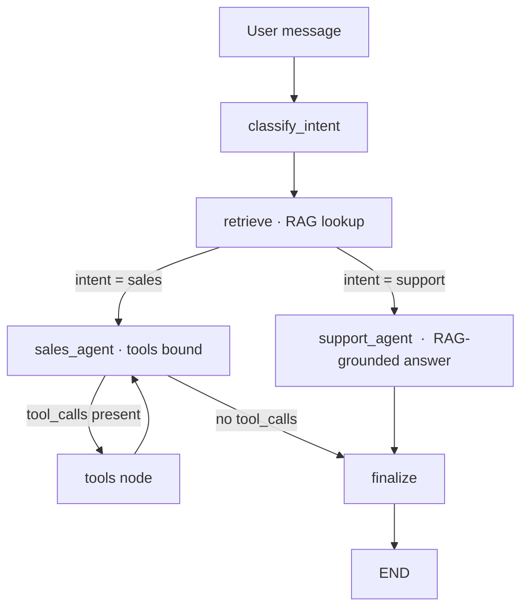
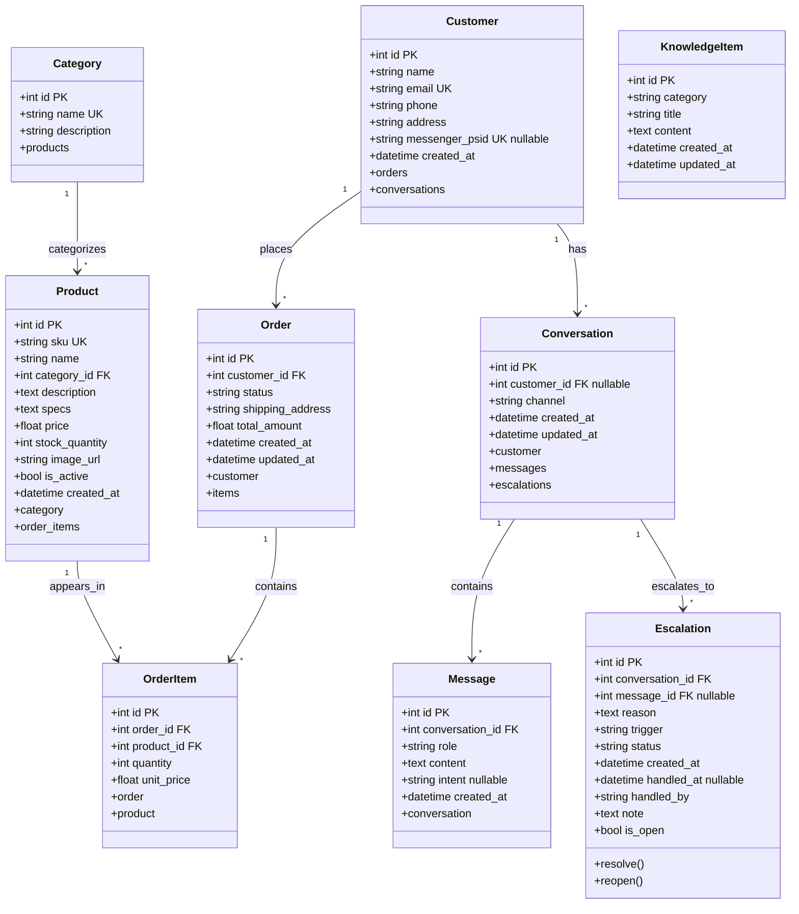

# NovaTech AI Sales & Customer Service Agent

**Meta Messenger integration**, allowing the agent to handle customer queries and orders through Facebook Messenger feel free to try messaging it: https://www.facebook.com/profile.php?id=61594332399569

**Live Demo:** https://competing-ecommerce-device-davidson.trycloudflare.com

NovaTech is a small electronics store used to demonstrate a complete
AI support and sales workflow. A customer can ask about products or store
policies, receive an answer grounded in the knowledge base, add an item to a
cart, and place an order. Those actions are persisted in SQLite and can be
reviewed from the Flask dashboard.

The project uses **Flask, SQLAlchemy, LangGraph, local MiniLM embeddings, and
Gemini or Groq**. The tests replace the live model with a deterministic scripted
model, so the important workflows can be checked without an API key.

```
Browser ──► /api/chat ──► LangGraph agent ──► tools ──► SQLite
                ▲                                          │
                └──────────── admin dashboard ◄────────────┘
```

---

## What it does

| Area                       | Capability                                                                                                        |
| -------------------------- | ----------------------------------------------------------------------------------------------------------------- |
| **Intent routing**   | Every message is classified as`sales` or `support`, then routed to the matching agent branch                  |
| **RAG**              | Retrieves relevant knowledge-base chunks (policies, delivery, FAQs) and grounds the reply in them                 |
| **Real tools**       | `search_products`, `check_product_availability`, `add_to_cart`, `place_order` all read/write the database |
| **Multi-turn**       | Conversation history is persisted and replayed so follow-up questions keep their context                          |
| **Admin dashboard**  | Products, orders, customers, chat transcripts, and full CRUD over the RAG knowledge base                          |
| **Live RAG updates** | Editing a knowledge item in the dashboard refreshes the retrieval index instantly                                 |
| **Bonus channel**    | A Meta Messenger webhook drives the*same* agent, with no changes to the graph                                   |

The one thing that is *not* real is the store itself: the catalog, policies and
customers are seed data for a fictional company.

---

## Architecture

### The agent graph



* **`classify_intent`** - one cheap LLM call that returns a single word
  (`sales` or `support`). Anything ambiguous falls back to `support`, the safer
  default. See `app/agent/prompts.py`.
* **`retrieve`** - runs for *both* branches so the support agent can ground its
  answer and the sales agent can quote real prices/specs.
* **`sales_agent`** - a ReAct-style loop: the model can call the business tools,
  the `tools` node executes them, and the result is fed back for another turn.
  The loop ends when the model replies without requesting a tool.
* **`support_agent`** - answers from the retrieved context only; it has no tools,
  so it cannot mutate data. If the context has no answer it says so instead of
  guessing.
* **`finalize`** - extracts the last assistant message (normalising provider
  content blocks) into `final_response`.

### Local semantic RAG

`app/rag/vector_store.py` uses the local **`all-MiniLM-L6-v2`** sentence
embedding model and cosine similarity. The model is downloaded once on first
startup and then runs locally. If it cannot be downloaded, the app falls back
to its deterministic TF-IDF index.

This choice is deliberate:

* semantic matching is better than lexical-only matching,
* no embedding API key is required,
* the model is small enough for a local assessment demo,
* and the retriever interface remains swappable for Chroma/pgvector later.

The store is rebuilt in memory on startup and after **every** knowledge-base
write (`app/rag/ingest.py`), which is what makes dashboard edits take effect on
the agent's very next reply.

### Tools are real writes

`add_to_cart` creates/updates `Order` + `OrderItem` rows; `place_order` moves a
cart to `confirmed` and **decrements stock**. Both are idempotent where they
should be (re-adding the same product increments the existing line) and
re-validate stock at checkout, so two customers cannot buy the same last unit.
Nothing is mocked and nothing is simulated.

---

## Project structure

```
Full-stack-LangGraph-agent-project-planning/
├── run.py                       # entry point (python run.py)
├── requirements.txt             # runtime dependencies
├── requirements-dev.txt         # + pytest
├── pytest.ini                   # testpaths + pythonpath
├── .env.example                 # copy to .env and fill in
├── app/
│   ├── __init__.py              # app factory: blueprints, tables, seed, index
│   ├── config.py                # all configuration, read from env vars
│   ├── extensions.py            # shared SQLAlchemy instance
│   ├── models.py                # Category, Product, Customer, Order, OrderItem,
│   │                            # Conversation, Message, KnowledgeItem
│   ├── seed.py                  # 12 products, 5 categories, 9 knowledge items
│   ├── agent/                   # the LangGraph agent
│   │   ├── graph.py             # StateGraph wiring (the diagram above)
│   │   ├── state.py             # AgentState TypedDict
│   │   ├── nodes.py             # classify_intent / retrieve / sales / support / finalize
│   │   ├── prompts.py           # the four system prompts
│   │   ├── tools.py             # the 4 business-action tools (real DB writes)
│   │   ├── llm.py               # Gemini/Groq provider factory
│   │   └── runner.py            # DB history -> LangChain messages -> graph
│   ├── rag/                     # retrieval
│   │   ├── vector_store.py      # MiniLM embeddings + cosine similarity
│   │   ├── retriever.py         # retrieve_context(query) -> prompt-ready block
│   │   └── ingest.py            # add/update/delete + refresh_index()
│   ├── routes/
│   │   ├── chat.py              # "/" demo widget and POST /api/chat
│   │   ├── dashboard.py         # /admin/... (products, orders, customers, RAG)
│   │   └── webhook.py           # bonus: Meta Messenger webhook
│   ├── templates/               # Jinja templates (base + dashboard/)
│   └── static/                  # css/style.css, js/chat.js
└── tests/                       # pytest suite (no API key required)
```

---

## Database structure

SQLite by default (`instance/novatech.db`, created and seeded on first run),
accessed through SQLAlchemy ORM models in `app/models.py`. Set `DATABASE_URL` to
use Postgres instead -- nothing in the code is SQLite-specific.




| Table               | Columns                                                                                                                                                                    | Notes                                                                                        |
| ------------------- | -------------------------------------------------------------------------------------------------------------------------------------------------------------------------- | -------------------------------------------------------------------------------------------- |
| `categories`      | `id`, `name` (unique), `description`                                                                                                                                 | 5 seeded; deleting one cascades to its products                                              |
| `products`        | `id`, `sku` (unique), `name`, `category_id` → categories, `description`, `specs`, `price`, `stock_quantity`, `image_url`, `is_active`, `created_at` | `is_active` is what the dashboard's "Active" checkbox controls                             |
| `customers`       | `id`, `name`, `email` (unique), `phone`, `address`, `messenger_psid` (unique, nullable), `created_at`                                                        | one row per email; Messenger users get a placeholder email tied to their PSID                |
| `orders`          | `id`, `customer_id` → customers, `status`, `shipping_address`, `total_amount`, `created_at`, `updated_at`                                                   | `status` ∈ `cart · pending · confirmed · shipped · cancelled`                       |
| `order_items`     | `id`, `order_id` → orders, `product_id` → products, `quantity`, `unit_price`                                                                                   | `unit_price` is snapshotted when the item is added; cascades when its order is deleted     |
| `conversations`   | `id`, `customer_id` → customers (nullable), `channel`, `created_at`, `updated_at`                                                                               | `channel` ∈ `web · messenger`; nullable so anonymous visitors work                     |
| `messages`        | `id`, `conversation_id` → conversations, `role`, `content`, `intent`, `created_at`                                                                            | `role` ∈ `user · assistant`; `intent` records which agent produced an assistant turn |
| `knowledge_items` | `id`, `category`, `title`, `content`, `created_at`, `updated_at`                                                                                               | the RAG corpus;`category` ∈ `faq · policy · delivery · general`                      |

Two design choices worth calling out:

* **A cart is an `Order` with `status='cart'`.** One table models both the
  in-progress cart and the placed order, which keeps `OrderItem` handling
  identical for both and makes checkout a status change plus a stock decrement.
  The dashboard filters `status='cart'` out of the Orders page.
* **`order_items.unit_price` is denormalised on purpose.** An order total must not
  change because someone edited a product's price the next day.

There is no migration tool: tables are created with `db.create_all()` at startup
(see `app/__init__.py`), and `app/seed.py` populates the catalog and knowledge
base only when those tables are empty.

---

## Available tools (function calling)

Four tools are defined in `app/agent/tools.py` with LangChain's `@tool`
decorator and bound to the sales node's model via `bind_tools()`. Each one
executes a real query or write against the database -- nothing is resolved from
the model's imagination. The `tools` node runs them and feeds the results back to
the model (see `app/agent/graph.py`).

| Tool                           | Arguments                                            | What it does                                                                                                                                                   | Touches                                          |
| ------------------------------ | ---------------------------------------------------- | -------------------------------------------------------------------------------------------------------------------------------------------------------------- | ------------------------------------------------ |
| `search_products`            | `query`, `category=""`, `max_price=0.0`        | Keyword search over name/description with optional category and price ceiling; returns up to 8 active products, cheapest first, each with SKU, price and stock | reads`products`, `categories`                |
| `check_product_availability` | `product_name`                                     | Stock level and price for one product, matched by partial name                                                                                                 | reads`products`                                |
| `add_to_cart`                | `customer_email`, `product_name`, `quantity=1` | Finds or creates the customer and their`cart` order, appends a line item or increments the existing one, recomputes the total                                | writes`customers`, `orders`, `order_items` |
| `place_order`                | `customer_email`, `shipping_address=""`          | Re-validates every line against current stock, decrements stock, stores the address and total, flips the order to`confirmed`                                 | writes`products`, `orders`                   |

Failures are returned as readable strings rather than raised, so the model can
explain the situation and suggest an alternative instead of the turn failing:

* unknown product → `"No matching products were found in the catalog."`
* too many units → `"Only 32 unit(s) of PulseBuds Pro are in stock; cannot add 99."`
* missing email → asks for it rather than guessing
* empty cart at checkout → `"The cart is empty, so there is nothing to order yet."`
* stock dropped between adding and checking out → the order is refused and stock
  is left untouched

Only the sales branch is given tools; the support branch runs unbound, so a policy
question can never create an order. `tests/test_tools.py` covers each case above,
and `tests/test_agent_graph.py` asserts that a reply *claiming* an order was
placed -- with no tool call -- writes nothing to the database.

---

## Quickstart

```bash
git clone https://github.com/Maya-Anber/Full-stack-LangGraph-agent-project-planning.git
cd Full-stack-LangGraph-agent-project-planning

python -m venv .venv
# Windows:
.venv\Scripts\activate
# macOS / Linux:
source .venv/bin/activate

pip install -r requirements.txt

cp .env.example .env        # then add GEMINI_API_KEY or GROQ_API_KEY

python run.py               # http://127.0.0.1:5000
```

On first start the app creates `instance/novatech.db`, seeds the catalog, and
builds the RAG index. No migration step is needed.

| URL                                   | What it is                     |
| ------------------------------------- | ------------------------------ |
| http://127.0.0.1:5000/                | Chat demo widget               |
| http://127.0.0.1:5000/admin/          | Admin dashboard                |
| http://127.0.0.1:5000/admin/knowledge | RAG knowledge base CRUD        |
| http://127.0.0.1:5000/webhook         | Meta Messenger webhook (bonus) |

To start from a clean database, delete `instance/novatech.db` and restart.

---

## Environment variables

Copy `.env.example` to `.env`. Choose one LLM provider and fill its API key.
`.env` is always read from the project root (next to `run.py`), and only **once,
at startup** -- restart the app after editing it. The provider you selected and
the key you filled in have to match: with `LLM_PROVIDER=groq` and only
`GEMINI_API_KEY` set, every chat request answers with *"GROQ_API_KEY is not set"*
(the same warning is logged at boot). A variable already exported in your shell
wins over the matching entry in the file. Model names get retired by both
providers, so if a request fails with *"model does not exist"*, pick a current
one from the provider's model list and put it in `GEMINI_MODEL`/`GROQ_MODEL`.

| Variable                  | Required            | Default                            | Purpose                                 |
| ------------------------- | ------------------- | ---------------------------------- | --------------------------------------- |
| `LLM_PROVIDER`          | no                  | `gemini`                         | `gemini` or `groq`                  |
| `GEMINI_API_KEY`        | Required for Gemini | –                                 | Gemini API key                          |
| `GEMINI_MODEL`          | no                  | `gemini-3.6-flash`               | Gemini model that supports tool calling |
| `GROQ_API_KEY`          | Required for Groq   | –                                 | Groq API key                            |
| `GROQ_MODEL`            | no                  | `openai/gpt-oss-120b`            | Groq model that supports tool calling   |
| `RAG_EMBEDDING_BACKEND` | no                  | `minilm`                         | `minilm` or `tfidf`                 |
| `RAG_EMBEDDING_MODEL`   | no                  | `all-MiniLM-L6-v2`               | Local SentenceTransformers model        |
| `FLASK_SECRET_KEY`      | no                  | `dev-secret-key`                 | Flask session/flash signing             |
| `DATABASE_URL`          | no                  | `sqlite:///instance/novatech.db` | Any SQLAlchemy URL (Postgres works)     |
| `FB_VERIFY_TOKEN`       | no                  | –                                 | Only for the Messenger webhook          |
| `FB_PAGE_ACCESS_TOKEN`  | no                  | –                                 | Only for the Messenger webhook          |

The optional tuning variables `MAX_HISTORY_MESSAGES`, `RAG_TOP_K`, and
`RAG_MIN_SCORE` can also be set in `.env`; their defaults are shown above and
in `.env.example`.

Tuning knobs live in `app/config.py`: `RAG_TOP_K` (chunks retrieved, default 4),
`RAG_MIN_SCORE` (similarity floor, default 0.05), and `MAX_HISTORY_MESSAGES`
(turns replayed, default 12).

---

## Example conversations

`→ tool` lines are the real tool calls the agent makes; the tool results are what
the customer sees summarised in the reply.

**Sales -- find and buy a product**

```
Customer: do you have noise cancelling earbuds?
Agent:    We do -- the PulseBuds Pro at $179.00, with active noise cancellation
          and 30h total battery. Want me to add a pair to your cart?

Customer: yes please, I'm ada@example.com
  → tool: add_to_cart(customer_email="ada@example.com",
                      product_name="PulseBuds Pro", quantity=1)
Agent:    Added 1 x PulseBuds Pro to your cart -- that's $179.00 so far
          (1 line item). Ready to check out?

Customer: yes, ship it to 12 Test Street
  → tool: place_order(customer_email="ada@example.com",
                      shipping_address="12 Test Street")
Agent:    Order #4 is confirmed for ada@example.com -- 1 item, total $179.00.
          It should arrive in 3-5 business days.
```

That order now appears at `/admin/orders`, and `AU-PULSEBUDS` stock has dropped
by one.

**Support -- grounded in the knowledge base**

```
Customer: how long do refunds take?
  → retrieve: Return Policy (top match), Shipping & Delivery Times
Agent:    Refunds go back to your original payment method within 5-7 business
          days of us receiving the returned item. Returns are open for 30 days
          after delivery.

Customer: do you ship internationally?
  → retrieve: Shipping & Delivery Times
Agent:    Not yet -- we currently ship within the country only. Standard delivery
          is 3-5 business days (free over $50); express is 1-2 days for $14.99.
```

**The safety behaviours worth noting**

```
Customer: how do I bake sourdough bread?
  → retrieve: (no chunk scores above the floor)
Agent:    I'm not sure about that one -- I only cover NovaTech products, orders
          and policies. Happy to pass you to a human.

Customer: I'll take the Nova Phone 12 Mini
  → tool: check_product_availability("Nova Phone 12 Mini")
Agent:    That one's out of stock right now. The Nova Phone 12 ($799.00) has the
          same chipset in a larger body and is in stock -- or the ValuePhone 5 at
          $249.00 if you want to keep costs down.
```

**Multi-turn context** (history is replayed into each request)

```
Customer: what's your warranty on laptops?
Agent:    Every NovaTech product carries at least a 1-year warranty against
          defects; Pro-line laptops get 2 years. It doesn't cover accidental or
          liquid damage.

Customer: and on the Forge 16 Pro specifically?
Agent:    2 years, since it's in the Pro line -- and it's currently in stock.
```

---

## The interface

**Chat demo (`/`)** -- a transcript with avatars, timestamps and an intent badge
(`support agent` / `sales agent`) on every reply. Assistant answers keep light
markdown (bold, bullet lists, `code`), typing shows three animated dots, and a
few suggestion chips cover the questions people ask first. The composer grows
with the text, `Enter` sends, `Shift + Enter` starts a new line, **New chat**
clears the thread, and your email is remembered between visits so the agent can
add to your cart and place orders. Failures (a missing API key, an unreachable
server) appear as red bubbles instead of breaking the page.

**Admin dashboard (`/admin/`)** -- sticky sidebar, live count cards, and tables
that scroll sideways on narrow screens. Order/status/channel/intent all use the
same tinted badge set, empty states explain what to do next, and the whole app
respects `prefers-reduced-motion`.

---

## Admin dashboard

Everything the operator needs is under `/admin/`:

| Page                           | What you can do                                                                                                                                           |
| ------------------------------ | --------------------------------------------------------------------------------------------------------------------------------------------------------- |
| **Overview**             | Live counts plus the most recent orders and conversations                                                                                                 |
| **Products**             | Add, edit, delete; set price/stock/category; toggle*Active* (an inactive product disappears from the sales agent's search tool)                         |
| **Orders**               | Every placed order (carts are hidden), with line items, shipping address, total, and a status workflow (`pending → confirmed → shipped → cancelled`) |
| **Customers**            | Who exists, whether they arrived via web or Messenger, and how many orders they have                                                                      |
| **Conversations**        | Full transcripts, including which agent handled each reply                                                                                                |
| **Knowledge Base (RAG)** | Full CRUD over the retrieval corpus; the summary text and the index itself refresh on every save, so the agent uses new content on its very next message  |

There is **no authentication** on the dashboard -- it is a demo surface, not a
production admin. Bind to localhost or put it behind your own auth.

---

## Tests

```bash
pip install -r requirements-dev.txt
python -m pytest              # offline suite; no API key required
```

The suite runs the **real** graph, the real tools, the real database, and the
real routes. The only thing faked is the LLM: `tests/support.py` provides a
`ScriptedChatModel` that returns pre-scripted replies and identifies which node
is calling it from the system prompt it receives. That makes intent routing,
the tool-calling loop, and the final response all deterministic and offline.

| Test file                  | Covers                                                                                                                                                                                                                                               |
| -------------------------- | ---------------------------------------------------------------------------------------------------------------------------------------------------------------------------------------------------------------------------------------------------- |
| `test_rag.py`            | ranking/top-k/score-floor behaviour, retrieval for policy/shipping/discount questions, "no relevant context" for unrelated questions, and that dashboard writes are searchable immediately                                                           |
| `test_tools.py`          | all four tools: keyword/category/price search, in-stock vs out-of-stock, inactive products, cart creation and merging, stock limits, and checkout re-validation                                                                                      |
| `test_agent_graph.py`    | intent routing, RAG context reaching the prompt, personal-email handling, one-event and multi-round tool loops, parallel tool calls, "a reply alone never writes to the database", content-block normalisation, and the recursion-limit safety bound |
| `test_chat_api.py`       | the widget page and static assets, 400s, persistence of both turns, history replay on the second turn, customer linking, anonymous visitors                                                                                                          |
| `test_dashboard.py`      | every admin page renders, product CRUD (including deactivation), knowledge CRUD + live index refresh, order listing/status, customer and transcript pages, and 404s                                                                                  |
| `test_routes_webhook.py` | the verification handshake, per-sender customers/conversations, and ignoring non-text events                                                                                                                                                         |
| `test_end_to_end.py`     | chat → tools → order → dashboard, dashboard policy edit → next reply's grounding, and a Messenger sale landing in the same dashboard                                                                                                             |

The current suite contains 121 tests. The exact count may change as tests are
added; the important point is that it runs without network access or a
Gemini/Groq API key.

Everything runs offline: the test suite uses a scripted model and TF-IDF, so it
needs no API key or network calls. It also covers unhappy paths such as a
missing API key and a runaway tool loop.

---

## Meta Messenger (bonus)

The webhook drives the *same* graph, so nothing in `app/agent/` changes:

1. Create a Meta app with the Messenger product and subscribe it to a Page.
2. Expose this app over HTTPS (e.g. `ngrok http 5000`).
3. Set the callback URL to `https://<your-host>/webhook` and the verify token to
   the same value as `FB_VERIFY_TOKEN` in `.env`.
4. Put a Page access token in `FB_PAGE_ACCESS_TOKEN`.

Any message sent to the Page is then answered by the agent, and the exchange is
stored as a `messenger` conversation that appears in the dashboard alongside web
chats. `GET /webhook` handles Meta's verification handshake; `POST /webhook`
handles inbound messages and ignores non-text events such as delivery receipts.

Messenger gives us no email address, so the first message from a sender creates a
customer under a placeholder address derived from their PSID. That keeps the
cart/order tools working; a real deployment would collect the real email during
checkout.

---

## Design decisions

**MiniLM embeddings with a fallback.** Local semantic embeddings improve
retrieval while keeping knowledge-base data off third-party embedding APIs.
TF-IDF remains available for offline tests and restricted environments.

**A separate support branch with no tools.** The support agent deliberately
cannot write anything. A policy question should never be able to create an order,
so tool access is scoped to the branch that needs it rather than granted to
everything -- a smaller blast radius beats a shorter prompt.

**LLM-based intent classification.** Keyword matching would be cheaper, but
"do you have anything cheaper than the Forge?" vs "how long does a refund take?"
is exactly the sort of thing keywords get wrong. One extra small call per turn
buys robust routing, and the classifier is the cheapest call in the chain
(`temperature=0`, one-word answer).

**One graph, many channels.** Both the web widget and Messenger call
`run_agent()`; the channel only decides how the conversation row is created.

**Stock is only committed at checkout.** Adding to a cart does not reserve stock,
and `place_order` re-validates everything before decrementing, so abandoned carts
can't lose inventory and two customers can't buy the same last unit.

**Deterministic, offline tests.** Replacing the model with a scripted double
covers the whole pipeline (routing, tool loops, persistence, rendering) in ~20
seconds without spending tokens, and pins down behaviour that breaks silently.

**Thresholds in config.** `RAG_MIN_SCORE` is the main quality knob: raise it for
precision, lower it for recall.

---

